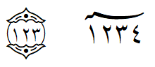
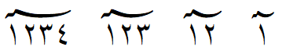
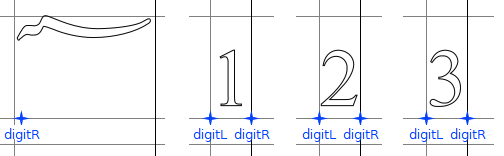
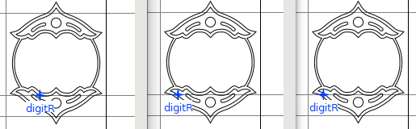

# Implementing Subtending marks

such as U+06DD End of Ayah and U+0605 Number Mark Above:

  

_NB: Some of the information and basic OpenType techniques described hearin were learned by studying the [Amiri font feature code](https://github.com/aliftype/amiri/blob/main/sources/enclosing.fea)._

## Background:

U+06DD is the Arabic "End of Ayah" character that encloses a digit or two (or three) and is one of a number of “subtending marks” defined by Unicode.

Unfortunately, due to Unicode history the OpenType font logic is slightly more complex than it otherwise would be. For details of the problem see [this proposal](http://www.unicode.org/cgi-bin/GetMatchingDocs.pl?L2/06-332), but in essence: 
- Prior to Unicode 5.1 the subtending marks could end up in a different directional run from the digits that followed, in some cases making the order appear backwards (visually the digits were left of the subtending mark) and font implementation difficult. 
- Starting in Unicode 5.1 the subtending marks were changed from Bidirectional_Class=AL to AN. This has the effect of putting the subtending mark and the digit sequence in the same directional run, making them easier to implement correctly.

## Historical Implications:

The upshot of this is that even today various implementations work differently, and as a result the logic inside fonts has to be smart enough to _work with either order_, i.e. when the subtending mark precedes digits or when it follows digits.

As a further result of these variations, OpenType font logic cannot use either _mark attachment_ or _cursive attachment_ lookups to reliably position digits upon subtending marks – the only reliable way I’ve found is through contextual single adjustment lookups. 

# SIL Implementation

## Digit sizes

The normal glyphs for digits are too large to be displayed with subtending marks, so we have smaller versions of all numeric digits that are to be so used. In fact for most of our fonts we have _two_ smaller sizes of digits:

- Medium digits are used in all cases for most of the subtending marks.
- Small digits are used
  - for the Disputed End of Ayah mark or
  - if there are 3 digits to be enclosed in an End of Ayah, thus allowing the End of Ayah to retain the same shape no matter whether there are 1, 2 or 3 digits following it.

The exception is Alkalami which uses different widths of End of Ayah for different numbers of digits, and in this case there are just medium digits, no small.

Note also that because of the desire to visually center the digits within End of Ayah, we utilize mono-width designs for all medium and small digits.

## Subtending mark design

As can be seen in this example using the Number Mark Above, alternate glyphs of each subtending mark are needed for different numbers of digits:



As described below, even End of Ayah needs multiple glyphs even though it doesn't typically change width.

Not all marks take the same number of digits. This can be changed if need arises, but at present here is what most of our fonts accommodate:

<table>
  <tr>
    <td>Subtending mark</td>
    <td>SIL default glyph name</td>
    <td>SIL digit limit</td>
  </tr>
  <tr>
    <td>U+0600 ARABIC NUMBER SIGN</td>
    <td>number-ar</td>
    <td>3</td>
  </tr>
  <tr>
    <td>U+0601 ARABIC SIGN SANAH</td>
    <td>year-ar</td>
    <td>4</td>
  </tr>
  <tr>
    <td>U+0602 ARABIC FOOTNOTE MARKER</td>
    <td>footnotemarker-ar</td>
    <td>2</td>
  </tr>
  <tr>
    <td>U+0603 ARABIC SIGN SAFHA</td>
    <td>pagenumber-ar</td>
    <td>4</td>
  </tr>
  <tr>
    <td>U+0604 ARABIC SIGN SAMVAT</td>
    <td>samvat-ar</td>
    <td>4</td>
  </tr>
  <tr>
    <td>U+0605 ARABIC NUMBER MARK ABOVE</td>
    <td>numbermark-ar</td>
    <td>4</td>
  </tr>
  <tr>
    <td>U+06DD ARABIC END OF AYAH</td>
    <td>endofayah-ar</td>
    <td>3</td>
  </tr>
  <tr>
    <td>U+08E2 ARABIC DISPUTED END OF AYAH</td>
    <td>endofayahdisputed-ar</td>
    <td>2</td>
  </tr>
</table>

We use `.2`, `.3`, and `.4` suffixes on glyph names to indicate how many digits a given glyph is designed to take. For example:
- `numbermark-ar` supports one digit
- `numbermark-ar.2` supports two digits
- `numbermark-ar.3` supports three digits

etc.

One thing this does for us is automatically create some useful classes:
- `c_2` all glyphs with `.2` extension
- `cno_2` corresponding class of glyph names without the `.2` extension
- `c_3` all glyphs with `.3` extension
- `cno_3` corresponding class of glyph names without the `.3` extension

etc.

## Anchors

Anchors are defined to help position the digits to the subtending marks. The digit glyphs have `digitL` (left side) and `digitR` (right side) anchors at the baseline to attach each digit to the previous one, while the subtending marks contain just the `digitR` anchor to define where the left-most of the digit sequence should be positioned:

 

As mentioned above, in most of our fonts the End of Ayah glyph doesn’t change width like the other subtending marks, but multiple glyph variants are still needed. This is because the _position_ of the first digit depends on how many digits there are. This is further complicated by the fact that the 1- and 2-digit versions of the glyph use the _medium_ size digits, while the 3-digit version uses the _small_ size digits in order to fit all of them in:



## Font logic

Both substitution and positioning rules are needed:

- Substitute the correct subtending mark glyph based on how many digits follow
- Substitute the medium or small digit glyphs for the normal-sized digit glyphs
- Adjust position of digits by attaching or aligning `digitL` to `digitR` anchors  

### Graphite logic

The graphite rules are relatively straightforward attachments using the `digitL` and `digitR` anchors, but of course have to be done in both orders. Details are left to the reader.

### OpenType logic

It would be nice if we could use _anchor_ or _cursive_ attachment rules (GPOS lookup types 4 or 3) for positioning digits on subtending marks but this doesn't work — at least it can only work in one of the needed orders (digits follow the mark). Rather than any attachment rules, we use FEAX to construct the adjustment rules to kern the digits to the correct position on the subtending marks.

### OpentType substitutions

Substituting the correct subtending mark (based on how many digits follow) and substituting the correct size digits (medium or small) can be done in a single contextual rule.

We start by making utility lookups that replace the subtending marks:


```
lookup SignWith_4digits_target {   # Replace subtending marks with 4-digit variant
  lookupflag IgnoreMarks ;
    sub @cno_4 by @c_4 ;
} SignWith_4digits_target ;

lookup SignWith_3digits_target {   # Replace subtending marks with 3-digit variant
  lookupflag IgnoreMarks ;
    sub @cno_3 by @c_3 ;
} SignWith_3digits_target ;

lookup SignWith_2digits_target {   # Replace subtending marks with 2-digit variant
  lookupflag IgnoreMarks ;
    sub @cno_2 by @c_2 ;
} SignWith_2digits_target ;
```

and add utility lookups to substitute the digits:

```
lookup SignDigits_ToMedium_target {  # replace digits with medium
  lookupflag IgnoreMarks ;
    sub @DigitsAny by @DigitsAnyMedium ;
} SignDigits_ToMedium_target ;

lookup SignDigits_Tosmall_target {  # replace digits with small
  lookupflag IgnoreMarks ;
    sub @DigitsAny by @DigitsAnysmall ;
} SignDigits_Tosmall_target ;

```

And now, remembering that we have to handle both orders, we write contextual substitution rules that reference these:


```
lookup SignWithDigits {
  lookupflag IgnoreMarks ;

  # Uniscribe or HarfBuzz 'latn' order

    # Handle subtending mark followed by 4 digits
    sub @c_4' lookup SignWith_4digits_target 
        @DigitsAny' lookup SignDigits_ToMedium_target 
        @DigitsAny' lookup SignDigits_ToMedium_target 
        @DigitsAny' lookup SignDigits_ToMedium_target 
        @DigitsAny' lookup SignDigits_ToMedium_target ;

    # Handle subtending mark (other than End of Ayah) followed by 3 digits
    sub [ year-ar samvat-ar pagenumber-ar numbermark-ar number-ar endofayah-ar ]' lookup SignWith_3digits_target 
        @DigitsAny' lookup SignDigits_ToMedium_target
        @DigitsAny' lookup SignDigits_ToMedium_target
        @DigitsAny' lookup SignDigits_ToMedium_target ;

    # Handle End of Ayah followed by 3 digits
    sub endofayah-ar' lookup SignWith_3digits_target 
        @DigitsAny' lookup SignDigits_ToSmall_target
        @DigitsAny' lookup SignDigits_ToSmall_target
        @DigitsAny' lookup SignDigits_ToSmall_target ;

    # Handle subtending mark followed by 2 digits
    sub @c_2' lookup SignWith_2digits_target 
        @DigitsAny' lookup SignDigits_ToMedium_target
        @DigitsAny' lookup SignDigits_ToMedium_target ;

    # Handle subtending mark followed by 1 digit
    sub @cno_2  
        @DigitsAny' lookup SignDigits_ToMedium_target ;

  # HarfBuzz 'arab' order

    # Handle 4 digits followed by subtending mark
    sub @DigitsAny' lookup SignDigits_ToMedium_target
        @DigitsAny' lookup SignDigits_ToMedium_target
        @DigitsAny' lookup SignDigits_ToMedium_target
        @DigitsAny' lookup SignDigits_ToMedium_target
        @c_4' lookup SignWith_4digits_target ;

    # Handle 3 digits followed by subtending mark other than End of Ayah
    sub @DigitsAny' lookup SignDigits_ToMedium_target
        @DigitsAny' lookup SignDigits_ToMedium_target 
        @DigitsAny' lookup SignDigits_ToMedium_target
        [ year-ar samvat-ar pagenumber-ar numbermark-ar number-ar]' 
          lookup SignWith_3digits_target ;

    # Handle 3 digits followed by End of Ayah
    sub @DigitsAny' lookup SignDigits_ToSmall_target
        @DigitsAny' lookup SignDigits_ToSmall_target 
        @DigitsAny' lookup SignDigits_ToSmall_target
        endofayah-ar' lookup SignWith_3digits_target ;

    # Handle 2 digits followed by subtending mark
    sub @DigitsAny' lookup SignDigits_ToMedium_target
        @DigitsAny' lookup SignDigits_ToMedium_target
        @c_2' lookup SignWith_2digits_target ;

    # Handle 1 digit followed by subtending mark
    sub @DigitsAny' lookup SignDigits_ToMedium_target
        @cno_2 ;

} SignWithDigits;
```

### OpenType positioning

Some assumptions:

- for all the digits, the `digitL` and `digitR` APs are positioned exactly on the sidebearings (this simplifies the math somewhat).
- all the medium digits have the same width and anchors, and similarly for the small digits if used. This means it doesn't matter which particular medium digit or small digit we use for calculations. I've chosen `zero.medium` and `zero.small`
- in our FEAX code, we let:
  - `m` represent the subtending mark glyph
  - `w` represent the the _negative_ of the width of the digits, which can be calculated in FEAX using, for example:
    ```
    let w = -ADVx("zero.medium) ;
    ```

In this description we will _not_ assume that all the subtending marks have the `digitR` anchor at the same height as the anchors of the digits, so we'll calculate a vertical kerning as well. 

We first have to understand what needs to be done to position digits with a subtending mark. Consider this 3-digit sequence:


Step one is to align first digit's `digitL` anchor with the subtending mark's `digitR`. To do this, calculate the offsets (x and y) from the digit's starting position to where we want it positioned. The starting position will be on the baseline immediately to the right of the subtending mark glyph, that is the digit's left sidebearing will align with the subtending mark's right sidebearing.

The amount the digit needs to be moved vertically to align its anchor to that of the subtending mark is the difference in the y coordinates of the anchors. In FEAX we can calculate that using:

```
let y = APy(m, "digitR") - APy("zero.medium", "digitL");
```

Horizontally we need to left-kern that first digit a distance equal to the width of the subtending mark minus the x-coordinate of the subtending mark's `digitR` anchor. Since a left-kern is negative, in FEAX we can calculate the value and save it in a variable `x1` by:

```
let x1 = APx(m, "digitR") - ADVx(m);
```

At the same time we kern the first digit, we want to remove its advancewidth. Thus we start out our contextual kerning rule using:

```
pos $m  @DigitsAnyMedium' <$x1 $y $w 0> @DigitsAnyMedium' @DigitsAnyMedium' ;
```

(For refresher on the `<...>` value record, see [Value record format B](https://github.com/adobe-type-tools/afdko/blob/develop/docs/OpenTypeFeatureFileSpecification.md#value-record-format-b) in the Adobe FEA specification.)

Considering the second digit, we want to move it from its starting position to a position immediately right of the first digit. Again we need to know the starting position of the second digit and this may surprise the reader. Because we removed the advance width of the first digit when we kerned it, the starting position of the second digit is the same as the first digit: immediately right of the subtending mark glyph. The kern distance for the second digit is, therefore, the same as that of the first but to the right by the width of the first digit. Because `w` is negative, we calculate the second digit's kern in FEAX as:

```
let x2 = x1 - w;
```

We can now add kerning for the second digit to our existing rule:

```
pos $m  @DigitsAnyMedium' <$x1 $y $w 0> @DigitsAnyMedium' <$x2 $y $w 0> @DigitsAnyMedium' ;
```

Adding similar logic for the 3rd digit and putting it all together gives us:

```
  let y = APy(m, "digitR") - APy("zero.medium", "digitL");
  let w = -ADVx(d); 
  let x1 = APx(m, "digitR") - ADVx(m); 
  let x2 = x1 - w; let x3 = x2 - w;
```
with positioning rules
```

pos $m  @DigitsAnyMedium' <$x1 $y $w 0> @DigitsAnyMedium' <$x2 $y $w 0>  @DigitsAnyMedium' <$x3 $y $w 0> ;
pos     @DigitsAnyMedium' <$x3 $y $w 0> @DigitsAnyMedium' <$x2 $y $w 0>  @DigitsAnyMedium' <$x1 $y $w 0> $m ;
```

Note that I've added a second positioning rule to handle the case where the subtending mark follows the digits — confirming it is correct is an exercise for the reader.

One last step is to put all this together with some FEAX that iterates through the subtending marks. The following links go to GitHub source of this technique in:
- [Scheherazade New](https://github.com/silnrsi/font-scheherazade/blob/cb17d5ea951bb60745726df52013ab3c7273d6d7/source/opentype/master.feax#L886)
  - Includes the latest subtending mark `endofayahdisputed-ar` which always takes small digits
- [Lateef](https://github.com/silnrsi/font-lateef/blob/71d95455105a6fb25a70f5e18eee5d94298a5efb/source/opentype/master.feax#L768)
  - Omits vertical kerning calculations
- [Harmattan](https://github.com/silnrsi/font-harmattan/blob/ce981527459389cce3749bfe9de531aa0d789d09/source/opentype/master.feax#L923)
  - At present this is the oldest version of the code and doesn't actually use iteration of the subtending marks.
  - Also omits vertical kerning calculations
